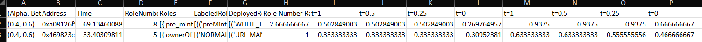

# SpCon: Finding Smart Contract Permission Bugs with Role Mining

* This page can be best viewed at: <https://github.com/Franklinliu/SpCon-Artifact>.
* This artifact has been archived at the following permanent location: [](https://doi.org/10.5281/zenodo.6534292)


* We wish to apply for the availability, functionality, and reusability badges.

### Contents

This readme first demonstrates how to quickly use *SpCon* to detect smart contract permission bugs with an example.
Then, we provide details on the result reproduction procedures for the two experiments from the paper.
Finally, we give an example to show how to reuse *SpCon* and its API documentation for potential reusability and integration in the future.

- [SpCon: Finding Smart Contract Permission Bugs with Role Mining](#spcon-finding-smart-contract-permission-bugs-with-role-mining)
    - [Contents](#contents)
    - [Directory Structures](#directory-structures)
  - [Get Started](#get-started)
    - [Prerequisites](#prerequisites)
    - [Quick Start](#quick-start)
  - [Build From Scratch](#build-from-scratch)
    - [Dockerization](#dockerization)
    - [Local Build](#local-build)
  - [Reproduction of Experiment Results](#reproduction-of-experiment-results)
    - [RQ1. Role Mining Evaluation](#rq1-role-mining-evaluation)
    - [RQ2. Permission Bug Detection](#rq2-permission-bug-detection)
  - [Reusability](#reusability)
    - [API Documentation](#api-documentation)
    - [More](#more)


### Directory Structures
```
spcon-artifact
│   README.md
│   localBuild.sh   
│   Dockerfile
|   CVE.list  
└───ISSTA2022Result
│   └─── CVEAccessControlResults  
│   └─── RoleMiningBenchmarkandResults   
|   └─── SmartBugsWildResults 
|   setup.py
└───spcon
    │   __main__.py
    │   query.py
    |   roleminger.py
    |   staticAnalyzer.py
    |   symExec.py
    └── spconbenchmarkminer.py  
```

| Files/Dirs                                                                        |  Descriptions                                                   |
|-----------------------------------------------------------------------------------|-----------------------------------------------------------------|
| [Spcon.pdf](./Spcon.pdf)                                                          | Paper PDF.                                                      |
| REAME.md                                                                          | This readme file.                                               |
| [localBuild.sh](./localBuild.sh)                                                  | Script used for local installation. See [Local Build](#local-build).                     |
| [Dockerfile](./Dockerfile)                                                        | Docker image make file, used for dockerization. See [Dockerization](#dockerization).   |             
| [CVE.list](./CVE.list)                                                            | The addresses of access-control CVE smart contracts.              |
| [CVEAccessControlResults](./ISSTA2022Result/CVEAccessControlResults/)             | 17 access-control CVE smart contracts and the detection result. |
| [RoleMiningBenchmarkandResults](./ISSTA2022Result/RoleMiningBenchmarkandResults/) | Benchmark and raw experiment results.                           |
| [SmartBugsWildResults](./ISSTA2022Result/SmartBugsWildResults/)                   | Detection results on the SmartBugs benchmark.                   |
| [spcon](./spcon/)                                                                 | SpCon tool implementation.                                      |

---

## Get Started

### Prerequisites

* We assume Docker is installed.
If not, please refer to the official website https://docs.docker.com/get-docker/ on how to install Docker. 
The artifact was tested on Docker version 20.10.7 and 20.10.14. 
* *SpCon* needs to access the Internet to retrieve source code and transaction histories of smart contracts from the
[Etherscan](https://etherscan.io/) and [BitQuery](https://bitquery.io/) website. 
We assume full access to these two website.

### Quick Start

To get started quickly, one may simply use the public docker image prepared for this artifact evaluation.
Just pull the docker image from dockerhub (`liuyedocker/spcon-artifact`) and start a docker container to execute an example task.
Run the following commands and it takes less than two minutes to finish.

```bash 
# install docker image 
docker pull liuyedocker/spcon-artifact:latest 
# run spcon to detect the permisson bug of MorphToken(0x2Ef27BF41236bD859a95209e17a43Fbd26851f92) which is a CVE smart contract. 
docker run --rm liuyedocker/spcon-artifact:latest spcon --eth_address 0x2Ef27BF41236bD859a95209e17a43Fbd26851f92
``` 
The expected results are as follows.
The terminal outputs show information such as compiler versions, function name list, total users, and user-function analysis. 
The first part of the output shows the statistics of past transactions in the history, such as how many functions appeared, and what the basic roles (user groups) are.
```
14  functions ['decimals', 'name', 'balanceOf', 'totalSupply', 'mintTokens', 'transferFrom', 'owned', 'transfer', 'burn', 'symbol', 'blacklistAccount', 'allowance', 'approve', 'transferOwnership']
No.user: 2831; No.func: 14
+-----------------------------------------------------+
|  Basic roles statistics (id, len(users), functions) |
+-----------+---------+-------------------------------+
|   RoleId  |  Users  |           Functions           |
+-----------+---------+-------------------------------+
|     0     |    2    |          ['decimals']         |
|     1     |    26   |         ['balanceOf']         |
|     2     |    23   |        ['transferFrom']       |
|     3     |    24   |           ['owned']           |
|     4     |   1830  |          ['transfer']         |
|     5     |    5    |         ['allowance']         |
|     6     |   1258  |          ['approve']          |
|     7     |    9    |         ['mintTokens']        |
|     8     |    3    |      ['blacklistAccount']     |
|     9     |    5    |     ['transferOwnership']     |
|     10    |    1    |       ['name', 'symbol']      |
|     11    |    1    |            ['burn']           |
|     12    |    1    |        ['totalSupply']        |
+-----------+---------+-------------------------------+
```

This part shows the role mining results by the GA role mining algorithm.
For this case, there are six mined roles: it shows which role may call which set of functions. 

```
Gen. 0 (0.00%): Max/Min/Avg Fitness(Raw)             [1.94(2.05)/1.45(1.39)/1.62(1.62)]
Gen. 100 (100.00%): INFO:spcon.symExec:Totally 0 integrity policies
INFO:spcon.symExec:Totally 2 integrity policies
Max/Min/Avg Fitness(Raw)             [2.04(2.18)/1.49(1.40)/1.70(1.70)]
Total time elapsed: 19.663 seconds.
best role number: 6
Role#0:{'decimals', 'transferOwnership'}
Role#1:{'name', 'balanceOf', 'symbol'}
Role#2:{'transfer', 'transferFrom'}
Role#3:{'burn', 'owned', 'totalSupply', 'blacklistAccount'}
Role#4:{'allowance'}
Role#5:{'approve', 'mintTokens'}
```

Finally, with a set of likely security policies among the role structures, *SpCon* found a set of attack sequences to break the security policies. The result shows permission attack sequences ``['owned']`` and ``['owned', 'blacklistAccount']``, which may be used to exploit the permission bug of the smart contract.

```
Security Policy:
Policy#0: approve mintTokens -> allowed via functions approve
Policy#1: burn owned totalSupply blacklistAccount -> owner isblacklistedAccount via functions owned blacklistAccount
INFO:spcon.symExec:Test Sequence: ['owned']
INFO:spcon.symExec:SymExecEVM().symExec: owned()
INFO:spcon.symExec:attacker: 0xc0ffee753b42bda1bcfa682f29685e2fd6729016
INFO:spcon.symExec:transaction status: success
CRITICAL:spcon.symExec:Permission Bug: find an attack sequence ['owned']
INFO:spcon.symExec:Test Sequence: ['blacklistAccount']
INFO:spcon.symExec:SymExecEVM().symExec: blacklistAccount(address,bool)
INFO:spcon.symExec:attacker: 0xc0ffee753b42bda1bcfa682f29685e2fd6729016
INFO:spcon.symExec:transaction status: false
INFO:spcon.symExec:test sequence is not feasible
2022-05-01 17:00:16,755: [1] m.e.manticore:INFO: Found a concrete globalsha3 
INFO:spcon.symExec:Test Sequence: ['owned', 'blacklistAccount']
INFO:spcon.symExec:SymExecEVM().symExec: owned()
INFO:spcon.symExec:attacker: 0xc0ffee753b42bda1bcfa682f29685e2fd6729016
INFO:spcon.symExec:transaction status: success
INFO:spcon.symExec:SymExecEVM().symExec: blacklistAccount(address,bool)
INFO:spcon.symExec:attacker: 0xc0ffee753b42bda1bcfa682f29685e2fd6729016
INFO:spcon.symExec:transaction status: success
CRITICAL:spcon.symExec:Permission Bug: find an attack sequence ['owned', 'blacklistAccount']
INFO:spcon.symExec:Testing time: 43.04372596740723 seconds
```


---

## Build From Scratch

In this section, we discuss technical details on how to build *SpCon* from scratch. We provide two alternatives.

### Dockerization 
The first one is to compile local docker image of *SpCon* using the provided Dockerfile.
The local docker image will be made about 10minutes at the first time.
Due to the layer caching mechanism of Docker, it would spend about two minutes if you later recompile the docker image for any update to the *SpCon* tool implementation.
```bash
# execute the below instructions and
docker build . -t spcon-artifact
# please verify if the docker can work as well by running the docker image for permission bug detection.
docker run --rm spcon-artifact:latest spcon --eth_address 0x2Ef27BF41236bD859a95209e17a43Fbd26851f92
```

### Local Build

Prerequisites:
* Python3.8
* Ubuntu (tested on Ubuntu 20.04)
  
Local build is supported for this artifact project.
We provide a one-click script  `localBuild.sh` to help you install all the dependencies and install *SpCon* in your system `$PATH` directory.
Please follow the below instructions to install *SpCon* and then run it for permission bugs detection. 
   ```bash 
   # install all the dependencies of the artifact
   # this would depend on your opertation environment and may not spent more than 10 minutes
   bash ./localbuild.sh
   # please verify if the following instruction can work as well for finding permissiong bugs of smart contract.
   spcon --eth_address 0x2Ef27BF41236bD859a95209e17a43Fbd26851f92
   ```

---


## Reproduction of Experiment Results 

Here are instructions on how to reproduce the experiment results on the role mining and the permission bugs detection.

### RQ1. Role Mining Evaluation

We build a tool `benchmarkminer` to evaluate role mining on any external benchmark smart contracts with ground truth.
By default, `benchmarkminer` will evaluate *SpCon* on the [OpenZeppelin benchmark smart contracts](./ISSTA2022Result/RoleMiningBenchmarkandResults/OpenZeppelin1000calls10methods) with the manually verified [ground truth](./ISSTA2022Result/RoleMiningBenchmarkandResults/OpenZeppelin1000calls10methods-label.xlsx) that are mentioned in the paper.
```
usage: benchmarkminer [-h] [--benchmark BENCHMARK] [--groundtruth GROUNDTRUTH]
                      [--output OUTPUT] [--simratio SIMRATIO] [--limit LIMIT]

SPCONMiner, Mining smart contract role structures

optional arguments:
  -h, --help            show this help message and exit
  --benchmark BENCHMARK
                        benchmark directory (default ./ISSTA2022Result/RoleMiningBen
                        chmarkandResults/OpenZeppelin1000calls10methods)
  --groundtruth GROUNDTRUTH
                        the labelled role structure (ground truth) for the
                        benchmark (default ./ISSTA2022Result/RoleMiningBenchmarkandR
                        esults/OpenZeppelin1000calls10methods-label.xlsx)
  --output OUTPUT       the output file containing result of mined role
                        structure and its comparison with the ground truth
                        (./result-OpenZeppelin_spconminer.xlsx)
  --simratio SIMRATIO   ratio of simErr for GA. (default 0.40)
  --limit LIMIT         how many benchmark contracts are inspected for the
                        role mining. (default 50)
```
The following instruction would evaluate on the role mining of two smart contracts from the OpenZeppelin benchmark . 
This would take about three minutes.

```bash 
# from pulled docker image
docker run --rm liuyedocker/spcon-artifact benchmarkminer --limit 2
```
Moreover, the reader can export result to the local machine using docker volume mount instruction `-v $HOME/localtmp:/dockertmp` as the following.
```bash
# either export result
docker run --rm -v $HOME/localtmp:/dockertmp liuyedocker/spcon-artifact benchmarkminer --limit 2 --output /dockertmp/result.xlsx
```
Once done, you can check the exported result file at the path `$HOME/localtmp/result.xlsx`.
Note that due to the randomness feature of GA, the result may vary a little at different runs.
The referred expected content of `$HOME/localtmp/result.xlsx` may be close to: 
The first column (Alpha, Beta) represents $\alpha$ and $\beta$ respectively introduced in the paper.
The fourth to eight columns show the number of mined roles, the structure of mined roles, and the label of the mined roles, the ground truth (deployed roles) as well as the ratio (`len(MinedRoles)/len(DeployedRoles)`).
The rest columns show the result accuracy at different threshold that is discussed in the paper.


For complete experiment reproduction, the reader can generate all raw results appearing in the papers using the following instructions.
This will take one and half an hour.
```bash 
# from pulled docker image
docker run --rm -v $HOME/localtmp:/dockertmp liuyedocker/spcon-artifact benchmarkminer --limit 50 --simratio 0.4 --output /dockertmp/result-0.4.xlsx
docker run --rm -v $HOME/localtmp:/dockertmp liuyedocker/spcon-artifact benchmarkminer --limit 50 --simratio 0.5 --output /dockertmp/result-0.5.xlsx
docker run --rm -v $HOME/localtmp:/dockertmp liuyedocker/spcon-artifact benchmarkminer --limit 50 --simratio 0.6 --output /dockertmp/result-0.6.xlsx
```
All results will be available at `$HOME/localtmp/result-0.4.xlsx`, `$HOME/localtmp/result-0.5.xlsx`,`$HOME/localtmp/result-0.6.xlsx`.
The reader can verify these results with reference to the [Experiment Result](./ISSTA2022Result/RoleMiningBenchmarkandResults/result-OpenZeppelin-SPCON.threshold_1_0.5_0.25_0.1642577052.234292.xlsx).


### RQ2. Permission Bug Detection
*SpCon* detected permission bugs of smart contract from two benchmarks: [CVE smart contracts](https://cve.mitre.org/cgi-bin/cvekey.cgi?keyword=smart+contract) and [SmartBugsWild](https://github.com/smartbugs/smartbugs-wild).

*SpCon* detected the bugs of nine contracts out of 17 access control CVE smart contracts.
For time saving, the reader can evaluate it using the following bash script.
This will take about one hour to perform this task.
```bash 
wget https://raw.githubusercontent.com/Franklinliu/SpCon-Artifact/master/CVE.list
# this would take about an hour to execute all cases. 
while read -r line; do docker run --rm liuyedocker/spcon-artifact spcon --eth_address $line >> execution.log 2>&1; done < CVE.list  
```
```bash
# this would filter the found permission attack sequences and then the vulnerable contracts can also be directly identified.
grep "attack sequence" execution.log
"
CRITICAL:spcon.symExec:Permission Bug: find an attack sequence ['owned']
CRITICAL:spcon.symExec:Permission Bug: find an attack sequence ['owned', 'blacklistAccount']
...
"
```
The expected result of CVE permission bugs detection can be found at [CVE-Result](./ISSTA2022Result/CVEAccessControlResults/ISSTA2022-CVE-AccessControl-ExperiementResults.xlsx).

---


## Reusability

Besides the replication of evaluation in the paper, *SpCon* can be used for role mining or permission bug detection on other real-world smart contracts.
Below is the usage instructions of *SpCon*.

```
usage: spcon [-h] --eth_address ETH_ADDRESS [--simratio SIMRATIO] [--mode MODE] [--workspace WORKSPACE] [--date DATE]

SPCON, Mine role structures of smart contracts for permission bug detection!

optional arguments:
  -h, --help            show this help message and exit
  --eth_address ETH_ADDRESS
                        Ethereum address of contract
  --simratio SIMRATIO   ratio of simErr for GA. (default 0.40)
  --mode MODE           running mode either 1: Mode_RoleMining or 2: Mode_Testing (default Mode_Testing)
  --workspace WORKSPACE
                        workspace directory (default ./)
  --date DATE           use transaction history up to which date YYYY-MM-DD (default latest)
```

Take the popular NFT application, namely Axie (`0xF5b0A3eFB8e8E4c201e2A935F110eAaF3FFEcb8d`) as an example,
the readers can execute the following instruction to mine the likely contract roles.

```bash
docker run --rm liuyedocker/spcon-artifact spcon --eth_address 0xF5b0A3eFB8e8E4c201e2A935F110eAaF3FFEcb8d --generation 500 --mode 1
```

Then you may get the expected output at terminal.

```
best role number: 6
Role#0:{'spawnAxie', 'getApproved'}
Role#1:{'getAxie', 'evolveAxie', 'ownerOf'}
Role#2:{'transferFrom', 'balanceOf'}
Role#3:{'isApprovedForAll', 'safeTransferFrom', 'setApprovalForAll', 'supportsInterface', 'approve'}
Role#4:{'paused'}
Role#5:{'setRetirementManager', 'setMarketplaceManager', 'setSpawningManager', 'setGeneManager', 'unpause', 'setTokenURIAffixes', 'setGeneScientist', 'setMarketplace', 'pause', 'setSpawner'}
```

*SpCon* can be used to detect permission bugs on any smart contract deployed on-chain. 
The command to use is the following:

```bash
docker run --rm liuyedocker/spcon-artifact spcon --eth_address 0xb47e3cd837dDF8e4c57F05d70Ab865de6e193BBB --generation 500 --mode 2
```
Note that a smart contract may have strong connection with others deployed on Ethereum. For a complicated smart contract application, it is not easy to perform successful testing because the actual blockchain environment cannot be fully simulated by the testing environment.

### API Documentation
We made an API documentation for *SpCon* available at [API.md](./API.md).

## SCOPE OF RIGHTS
You may use, copy, reproduce, and distribute this Software for any non-commercial purpose, subject to the restrictions in this NTUITIVE-LA. Some purposes which can be non-commercial are teaching, academic research, public demonstrations and personal experimentation. You may also distribute this Software with books or other teaching materials, or publish the Software on websites, that are intended to teach the use of the Software for academic or other non-commercial purposes.
You may not use or distribute this Software or any derivative works in any form for commercial purposes. Examples of commercial purposes would be running business operations, licensing, leasing, or selling the Software, distributing the Software for use with commercial products, using the Software in the creation or use of commercial products or any other activity which purpose is to procure a commercial gain to you or others.

If the Software includes source code or data, you may create derivative works of such portions of the Software and distribute the modified Software for non-commercial purposes, as provided herein.  
If you distribute the Software or any derivative works of the Software, you will distribute them under the same terms and conditions as in this license, and you will not grant other rights to the Software or derivative works that are different from those provided by this NTUITIVE-LA. 
If you have created derivative works of the Software, and distribute such derivative works, you will cause the modified files to carry prominent notices so that recipients know that they are not receiving the original Software. Such notices must state: (i) that you have changed the Software; and (ii) the date of any changes.

### More
If you would like to use *SpCon* in your research, please cite our ISSTA2022 paper.

```
@inproceedings{Liu2022FPB,
  author = {Liu, Ye and Li, Yi and Lin, Shang-Wei and Artho, Cyrille},
  booktitle = {Proceedings of the 31st ACM SIGSOFT International Symposium on Software Testing and Analysis (ISSTA)},
  month = jul,
  title = {Finding Permission Bugs in Smart Contracts with Role Mining},
  year = {2022}
}
```
